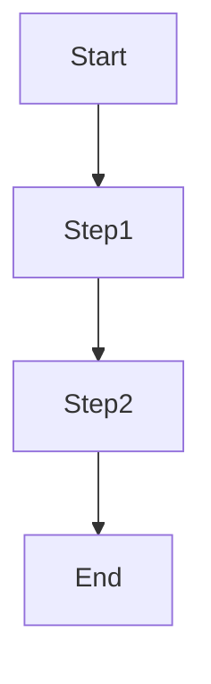

# Functional Spec: <Title>

[Header per `_header.md`]

## Use cases
| ID | Actor | Goal | Trigger | Main flow | Alternate flows | Exceptions |
|----|-------|------|---------|-----------|-----------------|------------|

## User flow

## Validation rules
| Field | Rule | Error message |
|-------|------|---------------|

## Permissions
| Role | Action | Allowed |
|------|--------|---------|

## Risks
- <risk> → <mitigation>

## Tests / Validation
- Functional spec reviewed by BA + Tech Lead on <date>.

## Next steps
1. Architect: technical design
