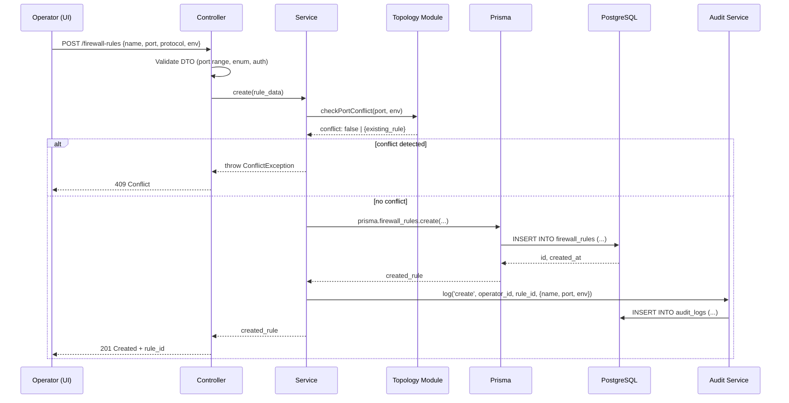

# Technical Design: <Title>

[Header per `_header.md`]

**Example**: "Firewall Rule API & Data Model" — Backend service for managing firewall rules with validation, audit logging, and topology integration.

## Context

**Problem**: Operators need a programmatic way to create, update, list, and delete firewall rules with automated compliance checks and audit trails.

**Who is affected**:
- DevOps operators (primary users via REST API)
- Platform engineers (via internal service calls)
- Compliance auditors (via audit logs)
- SysAdmins (monitoring rule changes)

**Constraints**:
- Must integrate with existing `topology` module to detect port conflicts
- Must support soft deletes (set `deleted_at`, never hard-delete)
- Must maintain audit trail in `audit_logs` table
- Must respect environment isolation (DEV/UAT/PROD)
- Must follow Prisma ORM patterns (see `docs/CONVENTIONS.md`)

**Links**:
- Epic: Epic-<id> "Firewall Rule Lifecycle Management"
- Related stories: SM-<ids>
- SRS: See [docs/SRS.md](../../../docs/SRS.md) Section "Firewall Rules"

## Proposal

The firewall rules feature consists of:

1. **Backend (NestJS)**:
   - `firewall` module with controller, service, DTOs, entity
   - Validation: port range (1-65535), protocol enum, environment enum
   - Conflict detection: query `topology.ports` before creating rule
   - Soft delete: `deleted_at` field in schema
   - Audit logging: trigger `audit_logs` insert on every mutation

2. **Frontend (React)**:
   - List page: table with rule name, port, protocol, environment, actions
   - Detail page: view rule, edit, delete (soft delete only)
   - Form component: create/edit rule with validation feedback
   - Hooks: `useFirewallRules()`, `useCreateRule()`, etc. using TanStack Query

3. **Database (Prisma)**:
   - `firewall_rules` table with fields: id, name, port, protocol, environment, created_at, updated_at, deleted_at
   - Index on (environment, deleted_at) for fast filtering
   - Migration: `./prisma/migrations/<timestamp>-firewall-rules.sql`

## Architecture diagram

```mermaid
flowchart LR
    UI["React UI<br/>(List, Detail, Form)"] -->|POST /api/v1/firewall-rules| API["NestJS Controller<br/>(firewall.controller)"]
    API -->|validate| Service["FirewallService<br/>(create, update, list, delete)"]
    Service -->|check conflicts| Topology["Topology Module<br/>(port lookup)"]
    Service -->|save to DB| ORM["Prisma ORM<br/>(firewall_rules table)"]
    ORM --> DB["PostgreSQL<br/>(firewall_rules, audit_logs)"]
    Service -->|log change| Audit["Audit Module<br/>(audit logging)"]
    Audit --> DB
    Style UI fill:#e1f5ff
    Style API fill:#fff3e0
    Style Service fill:#f3e5f5
    Style Topology fill:#e8f5e9
    Style ORM fill:#fce4ec
    Style DB fill:#eceff1
    Style Audit fill:#e8f5e9
```

## Sequence diagram



## Interface

### REST API

See `api-contract.md` for full specification.

**Endpoints**:
- `GET /api/v1/firewall-rules` — List rules (filtered by environment, excludes deleted)
- `GET /api/v1/firewall-rules/:id` — Get single rule
- `POST /api/v1/firewall-rules` — Create rule (validate port, check conflicts)
- `PATCH /api/v1/firewall-rules/:id` — Update rule
- `DELETE /api/v1/firewall-rules/:id` — Soft delete (set deleted_at)

**Request/Response**: JSON, conventional REST, see `api-contract.md`

### Internal Contracts

**Topology module integration**:
- Firewall service imports `TopologyService`
- Method: `checkPortConflict(port: number, environment: string): Promise<boolean | ConflictError>`
- Used in `FirewallService.validateRuleBeforeCreate()`

**Audit module integration**:
- Firewall service imports `AuditService`
- Method: `log(action: 'create'|'update'|'delete', operator_id: string, resource: 'firewall_rule', resource_id: string, changes: any)`
- Triggered on every mutation (create, update, delete)

## Data model changes

See `db-migration.md` for Prisma schema and migration SQL.

**New table**: `firewall_rules`

```sql
CREATE TABLE firewall_rules (
  id UUID PRIMARY KEY DEFAULT gen_random_uuid(),
  name VARCHAR(255) NOT NULL,
  port INT NOT NULL CHECK (port >= 1 AND port <= 65535),
  protocol VARCHAR(10) NOT NULL CHECK (protocol IN ('tcp', 'udp')),
  environment VARCHAR(50) NOT NULL CHECK (environment IN ('DEV', 'UAT', 'PROD')),
  created_at TIMESTAMP NOT NULL DEFAULT NOW(),
  updated_at TIMESTAMP NOT NULL DEFAULT NOW(),
  deleted_at TIMESTAMP,
  created_by_id UUID NOT NULL REFERENCES users(id),
  UNIQUE(name, environment),
  INDEX idx_env_deleted (environment, deleted_at)
);
```

## Failure modes

| Mode | Symptom | Detection | Mitigation |
|------|---------|-----------|------------|
| Port conflict with topology | Rule creates duplicate port entry | API returns 409 Conflict | Query topology before create; validate against port registry |
| Audit log fails | Operator creates rule but audit not logged | Missing entry in `audit_logs` table | Use database transaction; fail entire operation if audit fails |
| Soft delete not enforced | Deleted rule still visible in API | List returns deleted_at != null rows | Always filter `WHERE deleted_at IS NULL` in queries |
| Role check bypassed | Non-operator user creates rules | Invalid auth on production | Middleware enforces role + environment check on controller |
| Database constraint violated | Duplicate name in same environment | Integrity error from DB | DTO validation + unique constraint in schema |

## Migration / rollout

**Phase 1 (additive, backwards compatible)**:
- Add `firewall_rules` table to schema
- Add `firewall` NestJS module with REST endpoints
- Add React UI (list, create, edit, delete pages)
- Tests: unit (service, validation), integration (API), E2E (UI flows)
- Deploy to DEV, test with real workloads

**Phase 2 (feature flag control, optional)**:
- Feature flag: `FEATURE_FIREWALL_RULES` (default: false)
- Allows staged rollout: test on UAT → enable for subset of operators → full PROD
- Disable flag if critical issues found

**Phase 3 (deprecation, if replacing legacy system)**:
- Migrate existing rules from old system to new table
- Notify operators of migration
- Decommission old system (if applicable)

## ADR impact

**New ADRs**:
- ADR-<id>: Use REST API for firewall rules (vs GraphQL)
- ADR-<id>: Store rules in PostgreSQL (vs external firewall manager)
- ADR-<id>: Soft delete strategy for audit compliance

**Affected ADRs**:
- ADR-<existing>: Audit logging strategy (already defined, extends to firewall module)
- ADR-<existing>: Environment isolation (already defined, applies here)

(See `.ai/memory/decisions.md` for full ADR catalogue)

## Alternatives considered

1. **GraphQL instead of REST**
   - Why rejected: REST is simpler for this CRUD operation, team more familiar with it, fewer layers of abstraction

2. **Hard delete with tombstone table**
   - Why rejected: Soft delete with `deleted_at` is simpler, aligns with existing audit log pattern, no need for separate table

3. **External firewall manager (e.g., pf, iptables)**
   - Why rejected: This is a *configuration management* system, not an active firewall controller. Rules stored in DB, operators apply manually to infrastructure.

## Open questions

- **Q**: Should we validate port against actual listening ports on servers, or just firewall rules table?
  - **Current assumption**: Just firewall rules table (simpler), topology module has live port scan data if needed later
- **Q**: Should rule updates require changeset approval in PROD (like other changes)?
  - **Current assumption**: Yes, all PROD changes through changeset workflow (see IMPLEMENTATION_DETAILS.md)

## Risks

- **Risk**: Operator forgets to apply rule to actual firewall, only creates entry in DB
  - **Mitigation**: Documentation and runbooks (see `.ai/workflows/release.md`); UI shows "needs deployment" status
- **Risk**: Port 0 or negative port bypasses validation
  - **Mitigation**: DTO class-validator with `@IsInt() @Min(1) @Max(65535)` decorators
- **Risk**: Soft delete audit trail too large, queries slow
  - **Mitigation**: Index on (environment, deleted_at); archive old audit logs periodically

## Tests / Validation

- [ ] **Code review**: Architect reviews API design, Topology integration points on <date>
- [ ] **Design review**: Tech Lead reviews task breakdown, estimates on <date>
- [ ] **Unit tests**: Service logic (create, validate, conflict detection) — 80% coverage minimum
- [ ] **Integration tests**: API endpoints with test DB, auth middleware, soft delete behavior
- [ ] **E2E tests**: Browser-based user journeys (create rule → see in list → edit → delete)
- [ ] **Manual testing**: On staging with UAT dataset, test role-based access (operator can create, non-operator cannot)
- [ ] **Performance testing**: Rule list with 1000+ rules, CRUD latency < 200ms p95

## Next steps

1. **Tech Lead** (`.ai/agents/tech-lead.md`):
   - Create task breakdown from this design
   - Assign to Senior Dev (backend), Senior Dev (frontend), QA
   - Create `db-migration.md` artifact
   - Create `api-contract.md` artifact
   - Enter tasks in `.ai/memory/active-tasks.md`

2. **Senior Dev** (`.ai/agents/senior-dev.md`):
   - Backend: Create `firewall.module.ts`, `firewall.controller.ts`, `firewall.service.ts`, DTOs
   - Frontend: Create `src/pages/firewall-rules/`, form component, hooks
   - Tests: Unit tests for service, integration tests for API
   - PR to `sprint/<N>` branch

3. **DevOps** (`.ai/agents/devops.md`):
   - Plan deployment for each environment (DEV → UAT → PROD)
   - Create rollback plan (see `rollback-plan.md`)
   - Prepare runbooks for rule deployment to actual infrastructure
