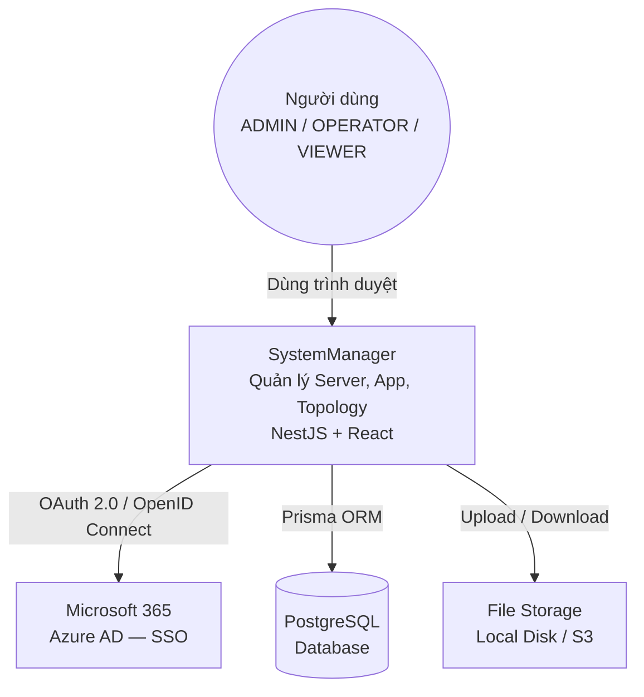
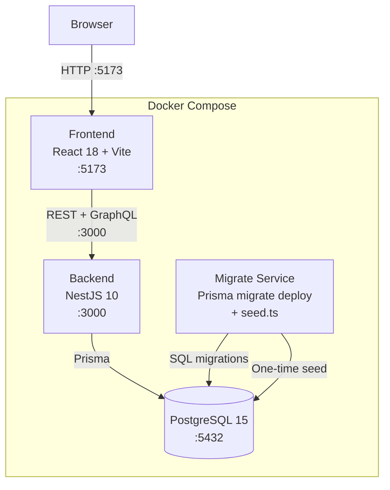

# Kiến trúc Hệ thống (System Architecture)

## 1. Tổng quan

SystemManager được xây dựng theo mô hình **Modular Monolith** — một backend duy nhất nhưng tổ chức code theo module domain độc lập. Lựa chọn này phù hợp với quy mô team nhỏ (2–5 dev) và không cần overhead của microservices.

```
┌─────────────────────────────────────────────────────┐
│                   Client (Browser)                   │
│              React SPA — port 5173                   │
└────────────────────────┬────────────────────────────┘
                         │ HTTP/WebSocket
┌────────────────────────▼────────────────────────────┐
│               NestJS Backend — port 3000             │
│  ┌─────────────┐  ┌──────────────┐  ┌────────────┐ │
│  │ REST /api/v1│  │ GraphQL      │  │ WebSocket  │ │
│  │  22 modules │  │ Topology     │  │ Subscript. │ │
│  └──────┬──────┘  └──────┬───────┘  └─────┬──────┘ │
│         └────────────────┴────────────────┘         │
│                    Prisma ORM                        │
└────────────────────────┬────────────────────────────┘
                         │
┌────────────────────────▼────────────────────────────┐
│           PostgreSQL 15 — port 5432                  │
└─────────────────────────────────────────────────────┘
```

---

## 2. C4 Model — Context Diagram



---

## 3. C4 Model — Container Diagram



---

## 4. Backend — Module Architecture

### 4.1 Danh sách 22 Modules

| Module | Prefix | Chức năng |
|--------|--------|----------|
| `auth` | `/api/v1/auth` | Login, refresh token, SSO MS365 |
| `user` | `/api/v1/users` | CRUD user, roles, login history |
| `user-group` | `/api/v1/user-groups` | CRUD nhóm người dùng, thành viên |
| `module-config` | `/api/v1/module-configs` | Bật/tắt modules toàn hệ thống |
| `server` | `/api/v1/servers` | CRUD server, import CSV |
| `hardware` | `/api/v1/hardware` | Thành phần phần cứng của server |
| `network` | `/api/v1/network-configs` | Cấu hình mạng, phát hiện IP conflict |
| `app-group` | `/api/v1/app-groups` | Nhóm ứng dụng (Business/Infrastructure) |
| `application` | `/api/v1/applications` | CRUD ứng dụng, system software |
| `deployment` | `/api/v1/deployments` | Deployment app lên server, import CSV |
| `port` | `/api/v1/ports` | Quản lý port (conflict detection) |
| `connection` | `/api/v1/connections` | Kết nối app-to-app, import CSV |
| `topology` | GraphQL `/graphql` | Query topology, snapshots |
| `changeset` | `/api/v1/changesets` | Draft → Preview → Apply thay đổi |
| `snapshot` | `/api/v1/snapshots` | Lưu/phục hồi topology snapshots |
| `audit` | `/api/v1/audit-logs` | Xem lịch sử thao tác |
| `change-history` | `/api/v1/change-histories` | Lịch sử thay đổi từng resource |
| `infra-system` | `/api/v1/infra-systems` | Hệ thống hạ tầng (nhóm server logic) |
| `import` | `/api/v1/import` | Import preview chung (CSV parser) |
| `system` | `/api/v1/system` | Status, init, seed demo data |
| `system-config` | `/api/v1/admin/system-config` | Cấu hình hệ thống (logging, v.v.) |
| `help` | `/api/v1/help` | Hướng dẫn dùng API |

### 4.2 Request Pipeline (Middleware Stack)

```
Request → JwtAuthGuard → RolesGuard → ModuleGuard
        → Controller (validation pipe)
        → AuditLogInterceptor (before)
        → Service → Prisma → DB
        → AuditLogInterceptor (after — ghi log)
        → TransformInterceptor (wrap response)
        → Response
```

**Guards:**
- `JwtAuthGuard` — bắt buộc JWT hợp lệ (bỏ qua nếu `@Public()`)
- `RolesGuard` — kiểm tra role từ decorator `@Roles('ADMIN')`
- `ModuleGuard` — kiểm tra module được ENABLED trong `module_configs`

**Interceptors:**
- `AuditLogInterceptor` — tự động ghi log mọi POST/PATCH/DELETE
- `TransformInterceptor` — chuẩn hóa response `{ data, meta, message }`

### 4.3 Chuẩn Module (Template)

```
src/modules/<name>/
├── <name>.module.ts        # @Module({ imports, controllers, providers })
├── <name>.controller.ts    # @ApiOperation, @Roles, @RequireModule
├── <name>.service.ts       # Business logic, inject PrismaService
├── <name>.resolver.ts      # GraphQL (chỉ topology module)
├── dto/
│   ├── create-<name>.dto.ts   # @IsNotEmpty, @IsIn (KHÔNG dùng @IsEnum)
│   ├── update-<name>.dto.ts   # PartialType(CreateDto)
│   └── query-<name>.dto.ts    # extends PaginationDto, tất cả @IsOptional
├── entities/
│   └── <name>.entity.ts       # @ApiProperty cho Swagger, shape response
└── __tests__/
    ├── <name>.controller.spec.ts
    └── <name>.service.spec.ts
```

> **Rule quan trọng:** Không inject Service của module khác. Giao tiếp qua Event Emitter hoặc expose method qua interface.

---

## 5. Frontend — Architecture

### 5.1 Cấu trúc thư mục

```
src/
├── App.tsx              # Router chính (React Router v6)
├── main.tsx             # Entry point
├── api/                 # Axios instance + TanStack Query hooks
│   ├── client.ts        # Axios với JWT interceptor + auto-refresh
│   └── hooks/           # useServers(), useApplications(), v.v.
├── graphql/             # Apollo Client + GQL queries/subscriptions
├── stores/              # Zustand global state
│   ├── authStore.ts     # user, token, isAuthenticated
│   └── uiStore.ts       # sidebar collapsed, theme
├── components/
│   ├── layout/          # AppLayout, Sidebar, Header
│   └── common/          # DataTable, ColumnMapper, StatusBadge
├── pages/               # 20 page groups (1 folder = 1 domain)
│   ├── topology/        # Trang phức tạp nhất (index.tsx + 5 components)
│   └── ...
└── types/               # TypeScript interfaces toàn cục
```

### 5.2 Data Flow

```
User Action → Component
           → TanStack Query mutation (useCreateServer, v.v.)
           → api/client.ts (Axios)
           → Backend REST
           → Prisma → PostgreSQL
           → Response → TanStack Query cache update
           → Component re-render
```

### 5.3 State Management

| Loại state | Tool | Ví dụ |
|-----------|------|-------|
| Server state (API data) | TanStack Query | Danh sách servers, topology data |
| Global UI state | Zustand | User info, sidebar, theme |
| Form state | React Hook Form + Zod | Tất cả forms |
| URL/filter state | React Router searchParams | Pagination, filter, tab |

---

## 6. GraphQL — Topology Module

Topology là module duy nhất dùng GraphQL, lý do:
- Data có cấu trúc phân cấp sâu (Server → Deployments → App → Connections)
- Cần Subscription realtime khi status server/app thay đổi
- Client có thể chọn fields cần thiết, tránh over-fetch

**Endpoint:** `POST /graphql`  
**Playground:** `GET /graphql` (development only)

**Query chính:**
```graphql
query Topology($environment: String) {
  topology(environment: $environment) {
    servers {
      id name hostname status environment
      networkConfigs { privateIp publicIp domain }
      deployments {
        id status environment
        application { id name code groupName }
        ports { portNumber protocol serviceName }
      }
    }
    connections {
      id sourceAppId targetAppId connectionType environment
    }
  }
}
```

**Subscriptions:**
- `serverStatusChanged` — khi status server thay đổi
- `connectionStatusChanged` — khi kết nối được tạo/xóa

---

## 7. Authentication & Authorization

### 7.1 JWT Flow

```
POST /auth/login (email + password)
→ Backend verify password (bcrypt, salt=12)
→ Trả về: { access_token (15m), refresh_token (7d) }

Client lưu tokens vào:
- access_token: memory (Zustand)
- refresh_token: httpOnly cookie hoặc localStorage

Khi access_token hết hạn:
→ Axios interceptor tự động gọi POST /auth/refresh
→ Nhận access_token mới (refresh_token rotate)
```

### 7.2 SSO Microsoft 365

```
GET /auth/ms365 → redirect đến Microsoft OAuth
→ Microsoft callback → GET /auth/ms365/callback
→ Backend tạo/sync user trong DB
→ Trả về JWT giống local login
```

### 7.3 RBAC (3 Roles cố định)

| Role | Quyền |
|------|-------|
| `ADMIN` | Toàn quyền: CRUD tất cả resources, quản lý users, bật/tắt modules |
| `OPERATOR` | Tạo/sửa servers, apps, deployments. Không quản lý được users |
| `VIEWER` | Chỉ đọc (GET). Không tạo/sửa/xóa |

Role được gán trực tiếp cho user (`user_roles`) HOẶC thừa kế từ `UserGroup` (`default_role`). Role cuối cùng = union của tất cả roles.

---

## 8. Audit Log System

Mọi thao tác POST/PATCH/DELETE được ghi tự động qua `AuditLogInterceptor` — không cần code thêm trong service.

**Cấu trúc log:**
```typescript
{
  userId: string,
  action: 'CREATE' | 'UPDATE' | 'DELETE' | 'LOGIN' | 'LOGOUT',
  resourceType: 'Server' | 'Application' | ...,
  resourceId: string,
  oldValue: JSON | null,   // snapshot trước khi thay đổi
  newValue: JSON | null,   // snapshot sau khi thay đổi
  ipAddress: string,
  userAgent: string,
  result: 'SUCCESS' | 'FAILED'
}
```

> Sensitive fields (password, tokens) bị loại trừ khỏi `oldValue`/`newValue`.

---

## 9. ChangeSet Workflow

Tính năng đặc biệt cho phép lên kế hoạch thay đổi hạ tầng trước khi áp dụng:

```
Tạo ChangeSet (DRAFT)
    ↓
Thêm ChangeItems (thêm server, đổi IP, v.v.)
    ↓
Preview → Chạy Virtual Topology Engine
         (Phát hiện conflict IP/port)
    ↓
APPLIED → Cập nhật DB thực + Tạo TopologySnapshot
    hoặc
DISCARDED → Không lưu gì
```

**State machine:**
```
DRAFT → PREVIEWING → APPLIED
  ↓         ↓
  └─────────┴──→ DISCARDED
```

---

## 10. Quyết định Kỹ thuật Quan trọng

| Quyết định | Lý do |
|-----------|-------|
| Monolithic thay vì Microservices | Team nhỏ, deployment đơn giản hơn |
| PostgreSQL thay vì MongoDB | Dữ liệu có quan hệ chặt, cần ACID |
| Prisma thay vì TypeORM | Type-safe, migration management tốt hơn |
| Ant Design thay vì Material UI | Enterprise look, phù hợp banking |
| TanStack Query thay vì Redux | Ít boilerplate, built-in cache/refetch |
| `@IsIn()` thay vì `@IsEnum()` | Tránh circular dependency giữa BE/Prisma types |
| Soft delete (`deleted_at`) | Audit trail không bị mất, có thể restore |
| GraphQL chỉ cho Topology | Chỉ Topology cần nested query + subscription |
