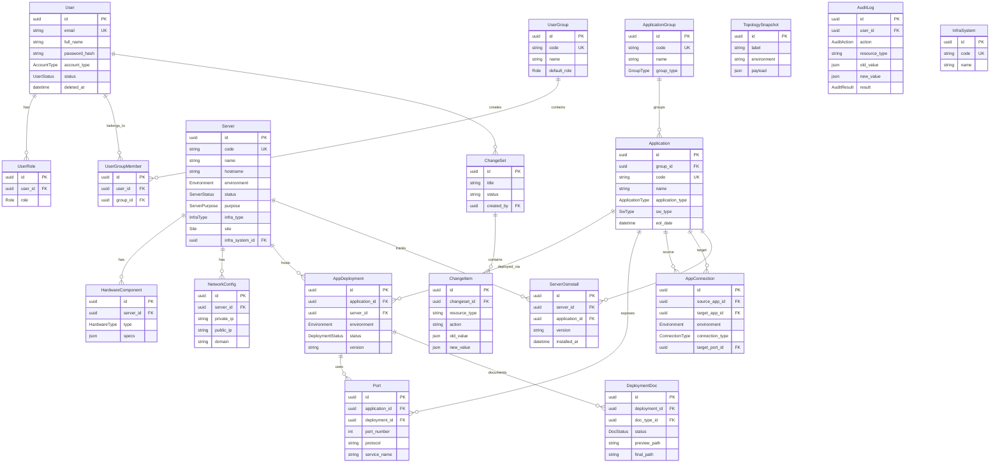

# Data Model — Schema Database

## 1. Tổng quan

Database PostgreSQL 15 với 24 bảng chính. Toàn bộ quản lý qua **Prisma ORM** (schema-first migrations).

**Quy tắc chung:**
- Primary key: `id UUID` (auto-generated)
- Timestamps: `created_at`, `updated_at` (auto-managed bởi Prisma)
- Soft delete: `deleted_at DateTime?` — KHÔNG hard delete
- Table names: `snake_case` plural
- Column names: `snake_case`
- Enums: `UPPER_SNAKE_CASE`

---

## 2. ER Diagram (Mermaid)



---

## 3. Chi tiết Từng Nhóm Bảng

### 3.1 Users & Auth

#### `users`
| Column | Type | Mô tả |
|--------|------|-------|
| `id` | UUID PK | — |
| `email` | VARCHAR(255) UNIQUE | Email đăng nhập |
| `full_name` | VARCHAR(255) | Tên hiển thị |
| `password_hash` | VARCHAR(255) nullable | null nếu dùng SSO |
| `account_type` | Enum | `LOCAL` hoặc `MICROSOFT_365` |
| `status` | Enum | `ACTIVE`, `INACTIVE`, `LOCKED` |
| `microsoft_id` | VARCHAR(255) nullable UNIQUE | Azure AD Object ID |
| `last_login_at` | DateTime nullable | — |
| `deleted_at` | DateTime nullable | Soft delete |

#### `user_roles`
Gán role trực tiếp cho user. Một user có thể có nhiều roles.

| Column | Type | Mô tả |
|--------|------|-------|
| `user_id` | UUID FK → users | — |
| `role` | Enum | `ADMIN`, `OPERATOR`, `VIEWER` |
| Constraint | UNIQUE(`user_id`, `role`) | — |

#### `user_groups` & `user_group_members`
Nhóm người dùng với `default_role`. User thừa kế role từ nhóm.

#### `refresh_tokens`
Lưu refresh token đã hash. Token rotate khi dùng.

### 3.2 Infrastructure

#### `servers`
Thực thể trung tâm của hạ tầng.

| Column | Type | Mô tả |
|--------|------|-------|
| `code` | VARCHAR(50) UNIQUE | Mã định danh nội bộ (VD: `SRV-APP-01`) |
| `environment` | Enum | `DEV`, `UAT`, `PROD` |
| `purpose` | Enum | `APP_SERVER`, `DB_SERVER`, `PROXY`, `LOAD_BALANCER`, `CACHE`, `MESSAGE_QUEUE`, `OTHER` |
| `infra_type` | Enum | `VIRTUAL_MACHINE`, `PHYSICAL_SERVER`, `CONTAINER`, `CLOUD_INSTANCE` |
| `site` | Enum | `DC` (Data Center), `DR` (Disaster Recovery), `TEST` |
| `status` | Enum | `ACTIVE`, `INACTIVE`, `MAINTENANCE` |
| `infra_system_id` | UUID FK nullable | Thuộc InfraSystem nào |
| `current_os_install_id` | UUID FK nullable | Trỏ đến bản ghi OS đang dùng |

#### `hardware_components`
CPU, RAM, HDD, SSD, NETWORK_CARD. Nhiều component trên 1 server. `specs` là JSON tự do (model, manufacturer, capacity, v.v.).

#### `network_configs`
Cấu hình mạng của server. Một server có thể có nhiều network interfaces.

**Conflict detection:** `private_ip` phải unique trong cùng `environment` (check trong service, không dùng DB constraint vì deleted records).

### 3.3 Applications

#### `application_groups`
Nhóm ứng dụng với 2 loại:
- `BUSINESS` — Ứng dụng nghiệp vụ (Core Banking, CRM, v.v.)
- `INFRASTRUCTURE` — Phần mềm hạ tầng (OS, Middleware, Database)

#### `applications`
Bao gồm cả ứng dụng nghiệp vụ và system software (đã hợp nhất từ Sprint 16).

| Column | Mô tả |
|--------|-------|
| `application_type` | `BUSINESS` hoặc `SYSTEM` |
| `sw_type` | Chỉ dùng cho SYSTEM: `OS`, `MIDDLEWARE`, `DATABASE`, `RUNTIME`, `WEB_SERVER` |
| `eol_date` | End-of-Life date (cảnh báo khi gần đến hạn) |
| `vendor` | Nhà cung cấp phần mềm |

### 3.4 Deployments

#### `app_deployments`
Mỗi record = 1 lần deploy app X lên server Y trong environment Z.

| Column | Mô tả |
|--------|-------|
| `status` | `RUNNING`, `STOPPED`, `DEPRECATED` |
| `title` | Tên đợt deploy (VD: "Deploy v2.1 PROD Jan 2026") |
| `deployed_at` | Thời điểm deploy thực tế |
| `planned_at` | Thời điểm dự kiến |
| `cmc_name` | Tên Change Management ticket |
| `deployer` | Người thực hiện deploy |

#### `ports`
Port mà app expose trong 1 deployment. Có thể có nhiều ports (HTTP + gRPC, v.v.).

| Column | Mô tả |
|--------|-------|
| `port_number` | Số port (1–65535) |
| `protocol` | `TCP`, `HTTP`, `HTTPS`, `GRPC`, v.v. |
| `service_name` | Tên service (VD: `grpc-api`, `http-admin`) |

**Conflict detection:** `(deployment.server_id, port_number, protocol)` phải unique trong cùng `environment`.

#### `deployment_docs`
Tài liệu kỹ thuật của deployment. Workflow:
```
PENDING → DRAFT (có preview) → COMPLETE (có final PDF)
       → WAIVED (miễn tài liệu, có lý do)
```

### 3.5 Connections

#### `app_connections`
Kết nối trực tiếp giữa 2 ứng dụng.

| Column | Mô tả |
|--------|-------|
| `source_app_id` | App nguồn (gọi đến) |
| `target_app_id` | App đích (được gọi) |
| `connection_type` | `HTTP`, `HTTPS`, `TCP`, `GRPC`, `AMQP`, `KAFKA`, `DATABASE` |
| `target_port_id` | Port cụ thể trên app đích (nullable) |
| `environment` | Môi trường của kết nối |

### 3.6 ChangeSet

#### `change_sets` + `change_items`
Hệ thống quản lý thay đổi hạ tầng. `change_items.action` = `CREATE`, `UPDATE`, `DELETE`.

**Trạng thái ChangeSet:** `DRAFT` → `PREVIEWING` → `APPLIED` | `DISCARDED`

### 3.7 Audit & History

#### `audit_logs`
Tự động ghi bởi `AuditLogInterceptor`. Không ghi trực tiếp trong service.

#### `change_histories`
Snapshot từng resource theo thời gian (JSON). Dùng để hiển thị timeline thay đổi.

### 3.8 Topology Snapshots

#### `topology_snapshots`
JSON payload lưu toàn bộ trạng thái topology tại một thời điểm. Tự động tạo sau mỗi lần apply ChangeSet.

### 3.9 OS Lifecycle

#### `server_os_installs`
Theo dõi lịch sử cài đặt/nâng cấp OS trên server.

| Column | Mô tả |
|--------|-------|
| `application_id` | Trỏ đến Application có `sw_type = OS` |
| `installed_at` | Thời điểm cài đặt |
| `replaced_at` | Khi nào bị thay thế bởi bản mới (null = đang dùng) |
| `change_ticket` | Ticket thay đổi |

`Server.current_os_install_id` trỏ đến record `server_os_installs` hiện tại.

---

## 4. Enums Reference

```typescript
Role:            ADMIN | OPERATOR | VIEWER
UserStatus:      ACTIVE | INACTIVE | LOCKED
AccountType:     LOCAL | MICROSOFT_365
Environment:     DEV | UAT | PROD
ServerPurpose:   APP_SERVER | DB_SERVER | PROXY | LOAD_BALANCER | CACHE | MESSAGE_QUEUE | OTHER
ServerStatus:    ACTIVE | INACTIVE | MAINTENANCE
InfraType:       VIRTUAL_MACHINE | PHYSICAL_SERVER | CONTAINER | CLOUD_INSTANCE
Site:            DC | DR | TEST
HardwareType:    CPU | RAM | HDD | SSD | NETWORK_CARD
GroupType:       BUSINESS | INFRASTRUCTURE
ApplicationType: BUSINESS | SYSTEM
SwType:          OS | MIDDLEWARE | DATABASE | RUNTIME | WEB_SERVER | OTHER
DeploymentStatus:RUNNING | STOPPED | DEPRECATED
DocStatus:       PENDING | DRAFT | COMPLETE | WAIVED
ConnectionType:  HTTP | HTTPS | TCP | GRPC | AMQP | KAFKA | DATABASE
AuditAction:     CREATE | UPDATE | DELETE | LOGIN | LOGOUT | ENABLE_MODULE | DISABLE_MODULE | VIEW_SENSITIVE
AuditResult:     SUCCESS | FAILED
ModuleType:      CORE | EXTENDED
ModuleStatus:    ENABLED | DISABLED
```

---

## 5. Indexes

Các index đã có để tối ưu query phổ biến:

| Bảng | Index columns | Mục đích |
|------|--------------|----------|
| `servers` | `environment`, `status`, `infra_system_id` | Filter servers theo env/status |
| `app_deployments` | `application_id`, `server_id`, `environment` | Join và filter deployments |
| `app_connections` | `source_app_id`, `target_app_id`, `environment` | Build topology |
| `audit_logs` | `user_id`, `(resource_type, resource_id)`, `created_at` | Query audit history |
| `network_configs` | `server_id`, `private_ip` | IP conflict detection |
| `ports` | `application_id`, `deployment_id` | Port lookup |

---

## 6. Migration Workflow

```bash
# Tạo migration mới
cd packages/backend
npx prisma migrate dev --name <tên_migration>

# Áp dụng migration (production)
npx prisma migrate deploy

# Regenerate Prisma Client sau khi thay đổi schema
npx prisma generate

# Xem trạng thái migrations
npx prisma migrate status
```

**Quy tắc:**
- KHÔNG chỉnh sửa file migration đã có
- 1 migration = 1 thay đổi logic (không gộp nhiều thay đổi không liên quan)
- Migration name: `snake_case` mô tả thay đổi (VD: `add_port_service_name`)
